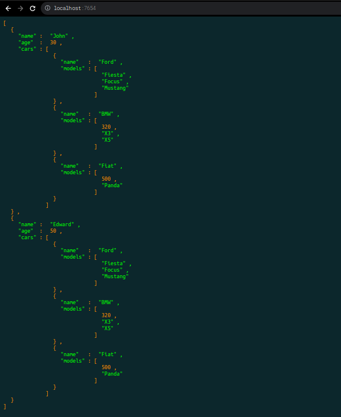

# JSON to HTML

Use this code to transform JSON to HTML.
```javascript

let jsonObject = [{
    "name": "John",
    "age": 30,
    "cars": [
        { "name": "Ford", "models": ["Fiesta", "Focus", "Mustang"] },
        { "name": "BMW", "models": ["320", "X3", "X5"] },
        { "name": "Fiat", "models": ["500", "Panda"] }
    ]},
    {
        "name": "Edward",
        "age": 50,
        "cars": [
            { "name": "Ford", "models": ["Fiesta", "Focus", "Mustang"] },
            { "name": "BMW", "models": ["320", "X3", "X5"] },
            { "name": "Fiat", "models": ["500", "Panda"] }
        ]
    },
];


// let jsonObject = [1,2,3,4,5]
let html = JSON2HTMLPage(jsonObject);
fs.writeFileSync('index.html', html);

```

